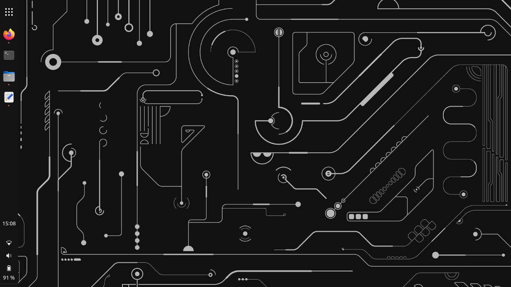

# A Gnome adventure

I'm was using Linux Mint with the XFCE4 desktop and I wanted to try Gnome. 
And now I'm hooked. In my opinion Gnome (customized to your likings) is vastly superior to 
all other desktop environments. But the installation process wasn't all smooth sailing...

### Login issues
When I installed gnome using apt and rebooted my computer, I was presented with a login 
screen. I wanted to log only to be presented with a known [bug](https://bugzilla.redhat.com/show_bug.cgi?id=1933520). I fixed it by booting linux in recovery mode and removing the fprintd apt package.

### Customization
I'm not a huge fan of the default Gnome environment. Inspired by Ubuntu, I had a specific UI in mind 
and I wanted to see it come to reality. Gnome doesn't seem to offer customization out of the box, so I had 
to install a few extentions:

- [Dash to panel](https://extensions.gnome.org/extension/1160/dash-to-panel/)

With what bothered me the most out of the way, the rest of the setup was relatively trivial, 
choosing a desktop image and exploring the default gnome programs.

Happy hacking!

