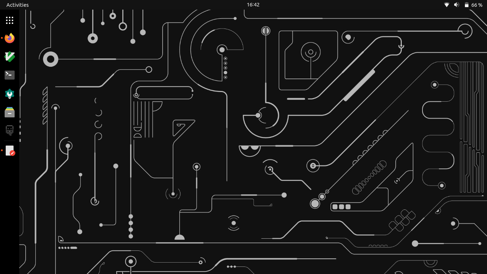

# A Gnome adventure

I'm was using Linux Mint with the XFCE4 desktop and I wanted to try Gnome. New to Linux 
in general (although confortable in the terminal), I wanted to see if I can customize my desktop 
to match exactly how I want it to look. 
And now I'm hooked. In my opinion Gnome (customized to your likings) is vastly superior to 
all other desktop environments. But the installation process wasn't all smooth sailing...

### Login issues
When I installed gnome using apt and rebooted my computer, I was presented with a login 
screen. I wanted to log only to be presented with a known [bug](https://bugzilla.redhat.com/show_bug.cgi?id=1933520). 
I fixed it by booting linux in recovery mode and removing the fprintd apt package. 

### Customization
I'm not a huge fan of the default Gnome environment. Inspired by Ubuntu, I had a specific UI in mind 
and I wanted to see it come to reality. Unlike XFCE, Gnome doesn't seem to be as customizable out of the box, so I had 
to install a few extentions:

- [Dash to dock](https://extensions.gnome.org/extension/307/dash-to-dock/) 
  Dash to panel was another contender, but given a known [issue](https://github.com/home-sweet-gnome/dash-to-panel/issues/1326), 
  I decided to use dash to dock instead.

### Current thoughts
Gnome seems like a nice desktop environment, and it definately feels more polished 
than all the other desktop environments I've tried. There's been some things I didn't 
see the point of... until I used it. For example, workspaces never really made sense to me, 
as I've only really had to habit of using one workspace for everything. But, trying two 
simultaneous workspaces (one for procrastnation and the other for work), the concept 
finally clicked for me.

My desktop will change as I learn more about Linux and the Gnome desktop environment, 
and now, instead of dreading the next update like I did on Windows, I feel enthusiastic 
about the changes I'll see to Gnome and to the Linux kernel itself.

Happy hacking!

